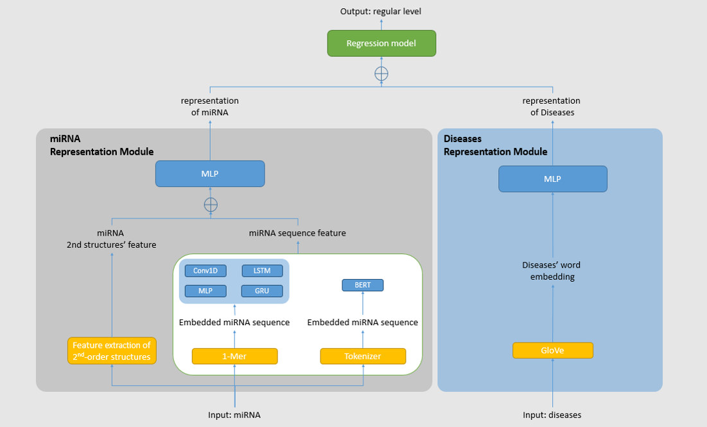

# RNA-disease-regulation-level-prediction-model
MiRNAs are important in physiological processes and also play a role in cancer and diseases. Traditional biotechnological methods to study miRNAs are expensive and time-consuming. To address this, the Human miRNA Disease Database (HMDD) was established to collect past bio-experiment based miRNA-disease research and literature. To predict potential miRNA-disease correlation, a pairwise association model was developed using machine learning methods to reduce unnecessary biological experiments. Our proposed deep regulation-level for miRNA-disease associations model uses GNN and GRU to train miRNA and disease feature extracting models to predict the regulation-level. This significantly improves research on miRNA-disease associations.

# Usage

## Data collection and pre-proccessing

### Training data download:
1. The MicroRNA-Disease data is from the Human microRNA Disease Database ([Link here](https://www.cuilab.cn/hmdd)).
2. The MeSH data is from National Library of Medicine ([Link here](https://meshb.nlm.nih.gov/)).
3. The miRNA seqence data is from mirBASE ([Link here](https://www.mirbase.org/ftp.shtml)).

### The following packages are required:

- pandas
- tqdm
- numpy
- requests
- bs4

### The data pre-proccessing must run in following order:
1. mesh_collection
2. mesh2graph
3. fasta2miRAN
4. vote_all_data
## Model Training
### Description:

To predict miRNA-disease associations, we adopted a two-step approach. Firstly, we utilized a Gate Recurrent Unit (GRU) to learn miRNA sequence features. Next, we applied a Graph Convolutional Network (GCN) to learn disease graph features from MeSH descriptors. Both miRNA and disease features were then combined and fed into a final multiple regression model simultaneously.The model architecture is illustrated in follow.

  

### The following packages are required:

- numpy
- pandas
- torch
- pickle
- seaborn
- tqdm
- matplotlib
- torch_geometric
- sklearn
- itertools
- scipy

# Credits
This project was created by [Kevin/Ping-Sung](https://github.com/Ping-Sung).

# Other
This repository is the code of the thesis "[植基於GCN與GRU的小分子核糖核酸對疾病調控等級預測模型](https://ndltd.ncl.edu.tw/cgi-bin/gs32/gsweb.cgi/login?o=dnclcdr&s=id=%22110NCHU5396065%22.&searchmode=basic)" writen by [Ping-Sung Cheng](https://github.com/Ping-Sung), and instructed by [Meng-Hsiun Tsai](https://ndltd.ncl.edu.tw/cgi-bin/gs32/gsweb.cgi/ccd=kK2Ql1/search?q=ade=%22Meng-Hsiun%20Tsai%22.&searchmode=basic#result).

Please feel free to contect [me](kevin0925.academic@gmail.com) for any further questions.
# License

This project is licensed under the [MIT License](https://opensource.org/licenses/MIT).